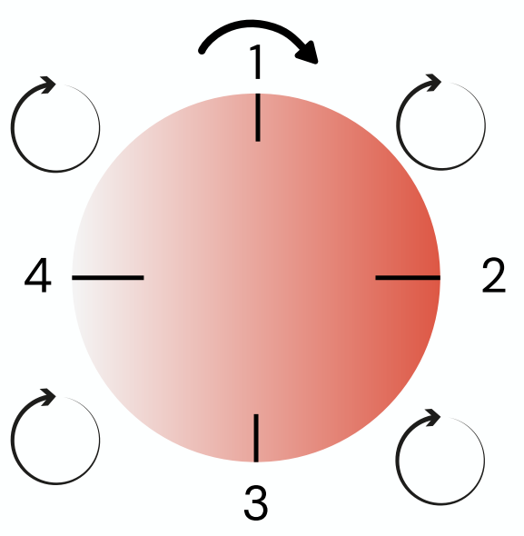
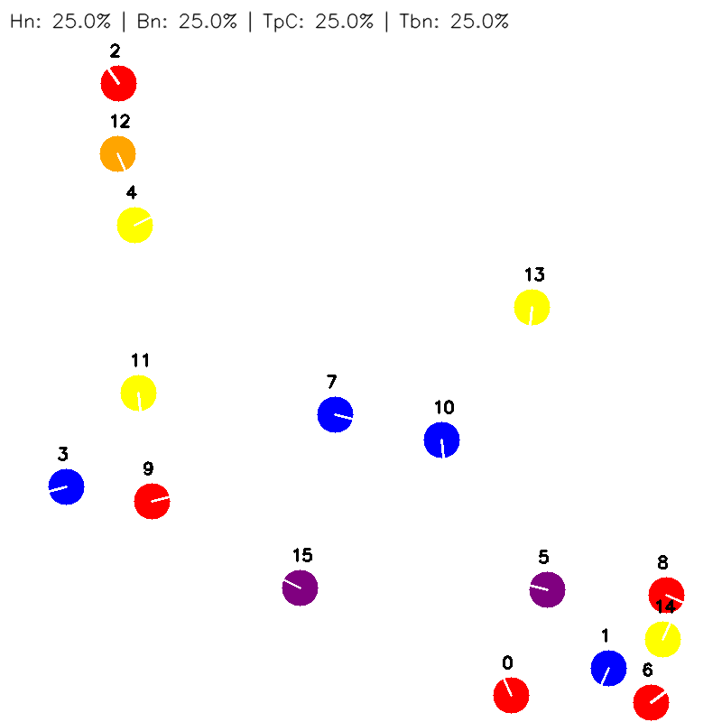

# Overview

Can a group of robots play together without the guidance of a conductor? The framework addresses this question by proposing a  decentralized organization of robots, implemented through principles of collective decision-making: such principles, inspired by behaviors observed in animal groups (such as fish schools or insect clusters) demonstrate how large populations can reach coherent decisions without relying on a central leader, but rather through continuous local interactions among individuals. 

Emergent Orchestra is a framework that corresponds on a 2-D simulation of a group of robots (swarm) that, coordinating themselves using collective behavior and decision-making processes inspired by the insect societes, play music basing on musical rules ( specified in *dictionaries.py* file) implemented on each individual. Each robot is figured as a circle inside a delimited area; the main important characteristics of the robots are:

- move within a predifined area, avoiding collisions among themselves and each other;
- play a note with an instrument;
- listen the note that someone else played;
- communicate personal infos to all neighbors and store recieved ones;

Robots have to organize themselves among 4 different music layers that are rhythm, beat pointer, harmony and timbral coordination;a specific module has been implemented in the robot for each layer, and each of them work synchronoulsy in order to reach swarm's music coherent decisions. The modules are:

- Phase Module; 
- Beat Module;
- Harmony Module;
- Timbre Module;

*Supervisor.py* is a class that simulates robot configuration and message exchange, which in real robotic platforms are typically implemented through Wi-Fi or infrared communication.


## Phase Module

Each robot has a phase with initial random value (like a clock), and the complete round of the phase corresponds to the length of the musical measure; robots increase phase value each millisecond of the simulation based on the BPM choosed by the user. When a robot hears a note played by another musician, stores player's current phase and aligns the proper one using **Kuramoto model**.

## Beat Module

Measure is divided equally in beats, and a random value *delay* is assigned to each robot: when its phase will cross that portion of measure, it will be able to play. To coordinate the moment on which every robot crosses the 0, **Firefly model** is implemneted: each agent assignes the start of the measure when its heard a *fortissimo* note, and the robot moves its beat pointer 1 step forward or above basing on how much far is from the first beat. Firefly effect is due to the natural behavior of the insect, taht coordinates when it fires observing the behavior of the other ones. 



## Harmony Module

To reach harmonic consensous, robots have to play a note that belongs to at least one muscial scale in common with the notes of the other muscians: to compute it, robot can store at maximum the last 4 heard notes, and have a probability of 70% to change their note. In the framework are implemented different typologies of musical scale (major, major pentatonic and exatonal). The module is inspired by the **naming game** model. 

## Timbre Module

Robots of the swarm has to choose instruments in order to form the correct ensemble: the configuration is estabilished by the relation between number of robots and number of beats. In the table below are reported implemented ensambles. 

| Num. of elements | Name      | Instruments |
|-----------------|-----------|-------------|
| 1  | Solo     | Trombone |
| 2  | Duo      | Violin, Viola |
| 3  | Trio     | Flute, Clarinet Bb, Violoncello |
| 4  | Quartet  | Trumpet C, Horn, Trombone, Bassoon |
| 5  | Quintet  | Oboe, Flute, Clarinet Bb, Bassoon, Horn |
| 6  | Sextet   | Violin, Viola, Violoncello, Double Bass, Flute, Oboe |
| 7  | Septet   | Trumpet C, Trombone, Horn, Bass Tuba, Clarinet Bb, Alto Sax, Violoncello |
| 8  | Octet    | Violin, Viola, Violoncello, Double Bass, Flute, Oboe, Clarinet Bb, Bassoon |
| 9  | Nonet    | Trumpet C, Trombone, Horn, Bass Tuba, Flute, Oboe, Clarinet Bb, Bassoon, Accordion |
| 10 | Decuplet | Violin, Viola, Violoncello, Double Bass, Flute, Oboe, Clarinet Bb, Bassoon, Trumpet C, Accordion |

To reach the correct distribution, robots implement **response threshold reinforcemnet and division of labour in insects societes**, a model that simulates how insects choose their task based on what they are comfrtable to do (*threshold*) and what the situation needs (*stimuli*). 

## Dataset 
Robots can choose among 13 different instruments thanks to a dataset of wav samples that corresponds to the notes that each instrument can play (folder data). Each folder contains the wav samples recorded from real instruments and are organized for notes: each of them has 3 different durations (0.5, 1 or 2 seconds) and 3 different dynamics (pianissimo, mezzoforte and fortissimo). In the framework, circles assume different color based on the choosed instrument; in the table below are reported corresponding colors and range of notes for each instrument. The dataset is the result of some modifications of TinySol dataset: https://zenodo.org/records/3685367. 

| Category              | Instrument            | MIDI Range | Samples | Color      |
| --------------------- | --------------------- | ---------: | ------: | ---------- |
| **Strings**           | Violin (Vn)           |     55–100 |     414 | cyan       |
|                       | Viola (Va)            |      48–96 |     441 | pink       |
|                       | Violoncello (Vc)      |      36–84 |     441 | dark blue  |
|                       | Double Bass (Cb)      |      28–72 |     405 | light cyan |
| **Woodwinds**         | Flute (Fl)            |      59–98 |     355 | pink       |
|                       | Oboe (Ob)             |      58–92 |     323 | green      |
|                       | Clarinet in B♭ (ClBb) |      52–92 |     378 | purple     |
|                       | Bassoon (Bn)          |      34–75 |     378 | blue       |
| **Brass**             | Trumpet in C (TpC)    |      54–87 |     288 | yellow     |
|                       | Trombone (Tbn)        |      34–73 |     345 | orange     |
|                       | Horn (Hn)             |      31–77 |     402 | purple     |
|                       | Bass Tuba (BTb)       |      30–65 |     324 | brown      |
| **Other Instruments** | Alto Sax (ASax)       |      49–81 |     297 | orange     |
|                       | Accordion (Acc)       |     28–109 |     762 | turquoise  |

# Usage

This framework requires Python and a dedicated virtual environment to manage dependencies.  
Before running the simulation, make sure to create and activate a Python virtual environment and install the required packages, listed in requirement.txt.

After completing the installation, user can customize the Emergent Orchestra by modifying the parameters defined in the 'configuration.ini' file. These parameters include, among others, the dimensions of the simulation area, the size of the robots, the total duration of the simulation, and the tempo of the generated music (e.g., 30, 60, or 120 BPM). Additionally, users may choose whether to generate a final MP4 video synchronized with a WAV audio file containing the notes played by the swarm.

To execute the framework, the user must specify via the command line:
- the number of simulations to run;
- whether the output video should be generated;
- the number of robots involved in the simulation.

Command examples are:

```bash
python main.py 1 true 8
python main.py 10 false 16
```

An example of frame of the resulting video that appears once finished the simulation is:



